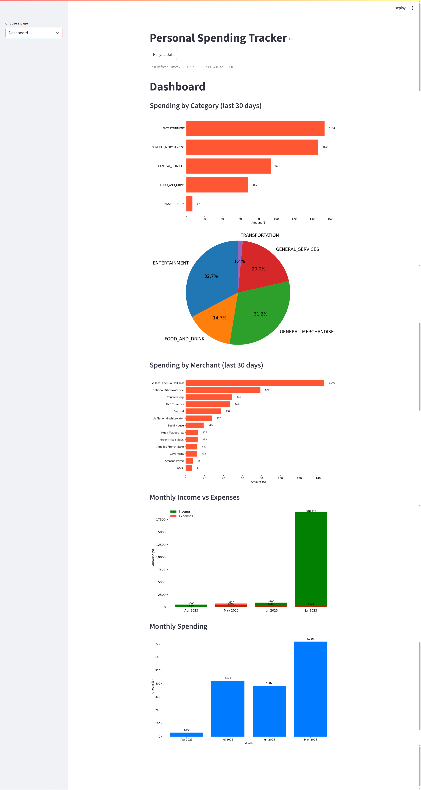

# spending-tracker
**Spending Tracker** is a personal finance dashboard built with **Python**, **Streamlit**, and **Plaid**. It securely connects to your bank and credit card accounts to fetch transaction data and visualize income, expenses, subscriptions, and spending patterns. Charts and metrics help users gain clear insights into their finances. Data is managed locally and synced to **Supabase** for cloud storage.

```txt
spending_tracker/
│
├── data/                     # Local data storage (ignored in Git, only .gitkeep tracked)
│   └── .gitkeep              # Placeholder to keep the folder in the repo
│
├── dash_functions.py         # Functions used for dashboard display and logic
├── dashboard.py              # Main Streamlit dashboard interface
├── database.py               # Handles Supabase read/write operations
├── fetcher.py                # Pulls data from Plaid and saves to Supabase
│
├── .gitignore                # Files/folders Git should ignore (like .env, venv/, etc.)
├── requirements.txt          # Python dependencies
├── README.md                 # Project overview and documentation
```

## Features
- Real data pulled from Plaid securely (secrets/keys stored in .env)
- Visualize Income vs. Expenses by Month
- Visualize Spending by Month
- Visualize Spending by Category (Bar and pie charts)
- Visualize Spending by Merchant 
- View net worth and breakdown by account type
- Track subscriptions
- Data saved on cloud to limit Plaid API calls
- Button to pull fresh data from Plaid
- Last refresh datetime shown

## Tech Stack
- Python
- Streamlit (Dashboard)
- Plaid API (Financial Data)
- Pandas (Data Analysis)
- Matplotlib (Data Visualization)
- Supabase (Cloud Backup)

## Example Page


**BY RICKY CIRCELLI**
